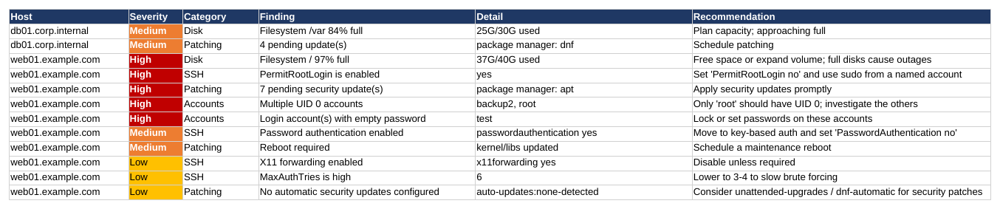
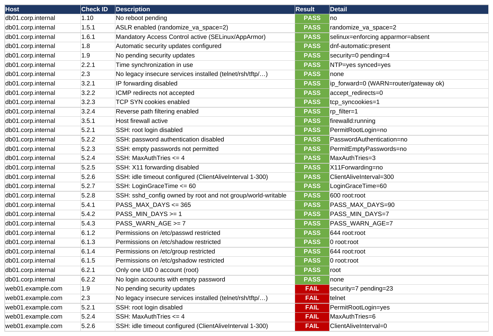
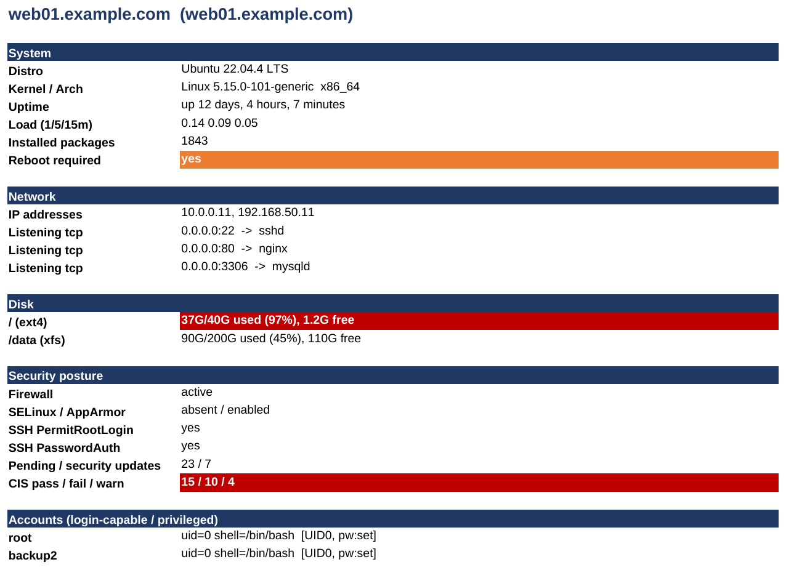

# linux-audit

**Agentless SSH inventory & security-hardening baseline for Linux fleets — one Excel report, one command.**

`linux_audit.py` connects to a list of Linux hosts over SSH, escalates with `sudo`,
runs a single read-only collection pass per host, and writes a formatted, multi-sheet
Excel workbook: full inventory plus prioritised hardening **Findings** and CIS-style
**PASS/FAIL/WARN** checks. It is agentless (nothing is installed on the targets),
reuses your existing SSH setup, and runs hosts in parallel.

> Only run this against systems you are explicitly authorised to access.

---

## Contents

- [Features](#features)
- [Screenshots](#screenshots)
- [How it works](#how-it-works)
- [Requirements](#requirements)
- [Installation](#installation)
- [Quick start](#quick-start)
- [Authentication](#authentication)
- [Command-line options](#command-line-options)
- [Host list format](#host-list-format)
- [Output workbook](#output-workbook)
- [Active-hosts file](#active-hosts-file)
- [Helper utilities](#helper-utilities)
- [Security considerations](#security-considerations)
- [Troubleshooting](#troubleshooting)
- [License](#license)

---

## Features

- **Agentless** — pure SSH + `sudo`; nothing installed on targets. One remote bash
  pass per host using section markers, so each host is one round trip, not dozens.
- **Reuses your SSH setup** — keys/agent/`~/.ssh/config`, `ProxyJump`, or password
  login via `sshpass`.
- **Parallel** — audits many hosts at once (`--workers`, default 8).
- **Graceful failure** — unreachable/auth-failed hosts are logged to an **Errors**
  sheet with the exact reason; the run continues.
- **Inventory** — IP addresses, distro, kernel/arch, uptime/load, disk usage,
  listening ports → process, running services, versions of common daemons, and the
  **full installed-package list**.
- **Hardening Findings** — severity-ranked (High/Medium/Low) issues with concrete
  recommendations.
- **CIS-style checks** — ~30 benchmark-style **PASS/FAIL/WARN** checks per host
  (SSH policy, file permissions, password aging, sysctl network hardening, MAC,
  firewall, patching, legacy insecure services, …).
- **Per-host detail tabs** — a one-page posture summary per server.
- **Active-hosts output** — writes a reusable list of the servers that actually
  responded.
- **Safe output** — every cell that could be interpreted as a spreadsheet formula is
  written as text, which prevents Excel "repair" warnings **and** neutralises
  spreadsheet formula-injection from untrusted host data.

## Screenshots

**Findings** — prioritised, colour-coded hardening issues:



**CIS Checks** — benchmark-style PASS / FAIL / WARN per host:



**Per-host detail tab** — one-page posture summary:



A complete example workbook is in [`examples/sample_audit.xlsx`](/examples/sample_audit.xlsx).

## How it works

For each host the tool runs (conceptually):

1. `ssh [user@]host` — using your key/agent, or a password via `sshpass`.
2. Escalate with `sudo` and run one read-only collector script that emits data in
   `@@SECTION`-delimited blocks.
3. Parse the sections, derive Findings and CIS results, and add the host to the
   workbook and to the active-hosts file.

The collector only **reads** state (it never changes configuration, and does not run
`apt update`/repo refresh). Update counts reflect each host's existing package cache.

## Requirements

**On the machine you run it from (the "controller"):**

- Python 3.9+
- [`openpyxl`](https://pypi.org/project/openpyxl/)
- The system `ssh` client
- `sshpass` — **only** if you use password SSH login (`--ask-ssh-pass`)

**On each target:** a POSIX shell and standard tools (`ip`/`ss`/`df`/`systemctl`/
`getenforce`/`dpkg`/`rpm`, etc.). Every probe is guarded, so missing tools are skipped
rather than fatal. The audited account must be able to `sudo` (password or passwordless).

## Installation

```bash
git clone https://github.com/vikozs/linux-audit.git
cd linux-audit
python3 -m pip install -r requirements.txt
```

Optionally install it as a command:

```bash
python3 -m pip install .
linux-audit --help
```

## Quick start

```bash
# key-based SSH + passwordless sudo
python3 linux_audit.py -H hosts.txt -o audit.xlsx

# password SSH login + sudo with the same password (one prompt)
python3 linux_audit.py -H hosts.txt -u username --ask-ssh-pass --sudo-pass-same-as-ssh -o audit.xlsx
```

Copy `hosts.example.txt` to `hosts.txt` and edit it first.

## Authentication

**SSH login**

| Mode | Flags |
|---|---|
| Key / agent / `~/.ssh/config` (default) | *(none)* |
| Explicit key file | `-i /path/to/key` |
| Password login | `--ask-ssh-pass` (prompt) or `--ssh-pass-env VAR` (from env) — needs `sshpass` |

**Privilege escalation (`sudo`)**

| Mode | Flags |
|---|---|
| Passwordless sudo (default) | *(none)* |
| Password sudo (prompt once) | `--ask-sudo-pass` |
| Reuse the SSH password for sudo | `--sudo-pass-same-as-ssh` |
| No escalation (unprivileged) | `--escalate none` |

Passwords are read from a prompt or an environment variable and passed over stdin —
never on the command line or in the process list. One prompt is reused for all hosts
(correct for a shared domain/service account).

## Command-line options

| Option | Description |
|---|---|
| `-H, --hosts PATH` | Host list file (required) |
| `-o, --output PATH` | Output `.xlsx` (default `linux_audit.xlsx`) |
| `--active-out PATH` | Write reachable hosts here (default `active_hosts.txt`; `''` to disable) |
| `-u, --user USER` | Default SSH user (overridable per line) |
| `-p, --port PORT` | Default SSH port |
| `-i, --identity FILE` | SSH private key |
| `--escalate {none,sudo}` | Escalation method (default `sudo`) |
| `--ask-sudo-pass` | Prompt once for the sudo password |
| `--sudo-pass-same-as-ssh` | Reuse the SSH password for sudo |
| `--ask-ssh-pass` | Password SSH login via `sshpass` (prompt) |
| `--ssh-pass-env VAR` | Read SSH password from an env var |
| `--ssh-opt OPT` | Extra `ssh -o` option, repeatable (e.g. `--ssh-opt ProxyJump=bastion`) |
| `--host-key-checking VAL` | `StrictHostKeyChecking` value (default `accept-new`) |
| `--connect-timeout N` | SSH connect timeout, seconds (default 10) |
| `--cmd-timeout N` | Per-host command timeout, seconds (default 120) |
| `--workers N` | Parallel hosts (default 8) |
| `--deep` | Also scan SUID/SGID and world-writable files (slower) |
| `--packages / --no-packages` | Full installed-package inventory (default on) |
| `--host-tabs / --no-host-tabs` | Per-host detail tabs (default on) |

## Host list format

One host per line. Blank lines and `#` comments are ignored.

```
web01.example.com
admin@db01.example.com
10.0.0.5:2222
bastion.example.com        # inline comments allowed
```

Accepted forms: `host`, `user@host`, `host:port`, `user@host:port`. The `-u` default
user applies to lines without an explicit `user@`.

## Output workbook

| Sheet | Contents |
|---|---|
| **About** | Run metadata, script build, sheet guide |
| **Summary** | One row per host with key facts and colour-coded risk cells |
| **Findings** | Severity-ranked hardening issues with recommendations |
| **CIS Checks** | Benchmark-style PASS/FAIL/WARN checks per host |
| **Disk** | Filesystems, usage, mount points |
| **Listening Ports** | Proto, local address:port, owning process |
| **Services** | Running services per host |
| **Software Versions** | Versions of detected common daemons |
| **Installed Packages** | Full package inventory (omit with `--no-packages`) |
| **Users & Auth** | Login-capable/privileged accounts, UID 0, sudo, password state |
| **SSH Config** | Effective `sshd` hardening settings |
| **&lt;hostname&gt;** tabs | One posture tab per host (omit with `--no-host-tabs`) |
| **Errors** | Unreachable/failed hosts and the reason |

> The CIS checks are heuristic, benchmark-style checks derived from collected data —
> useful as a hardening baseline, not a substitute for a certified CIS-CAT scan.

## Active-hosts file

After each run the reachable hosts are written to `active_hosts.txt` (change with
`--active-out`, disable with `--active-out ''`). It is a valid host list — the IP and
distro are trailing comments — so you can feed it straight back in:

```
# Active hosts as of 2026-07-09 12:00:00 — 78 reachable, 3 unreachable
sub.domain.loc              # 192.168.101.168  Red Hat Enterprise Linux 9.3 (Plow)
...
```

```bash
python3 linux_audit.py -H active_hosts.txt -u username --ask-ssh-pass --sudo-pass-same-as-ssh
```

## Helper utilities

- **`check_xlsx.py`** — verify a report contains no formula cells before opening it:
  ```bash
  python3 check_xlsx.py audit.xlsx
  ```
- **`fix_xlsx.py`** — repair a report made by an older build (converts any formula
  cells to text, preserving data and formatting):
  ```bash
  python3 fix_xlsx.py old_audit.xlsx        # writes old_audit_fixed.xlsx
  ```

## Security considerations

- **Authorisation.** Only audit hosts you are permitted to access.
- **Sensitive output.** Reports and host lists describe your infrastructure and its
  security posture. The provided [`.gitignore`](.gitignore) excludes `hosts.txt`,
  `active_hosts.txt`, and `*.xlsx` so you don't commit them by accident. Store and
  share reports accordingly.
- **Credential handling.** Passwords come from a prompt or env var and are passed via
  stdin — never on the command line.
- **Host keys.** Default `StrictHostKeyChecking=accept-new` adds new keys and refuses
  changed ones. On a trusted internal network with rebuilt/cloned hosts you may prefer
  `--host-key-checking no --ssh-opt UserKnownHostsFile=/dev/null`.
- **Formula-injection safe.** All cell text that could be read as a formula is written
  as text, so a compromised host cannot plant a payload that executes when the report
  is opened.

## Troubleshooting

**`sorry, you must have a tty to run sudo`** — the target has `Defaults requiretty` in
sudoers. Remove it, or open an issue to request a `--tty` (`ssh -t`) option.

**`Password SSH login needs 'sshpass'`** — install it (`dnf install sshpass` /
`apt install sshpass`) or use key-based auth.

**A host lands in the Errors sheet** — the message distinguishes DNS failure, timeout
(host down/firewalled), connection refused, and auth failures. Firewalled hosts wait up
to `--connect-timeout` before failing.

**Excel says "Removed Records: Formula from …"** — that report was made by an old build.
Run `python3 fix_xlsx.py <file>` and open the `_fixed` copy; new reports carry a
`Script build` tag on the About sheet and print `[build …]` at startup.

**OneDrive/SharePoint** — generate the report to a local path, verify with
`check_xlsx.py`, then move it into the synced folder. Writing directly into a live-
syncing folder (or over a file open in Excel) can cause locked/partial writes.

## License

Released under the [MIT License](LICENSE).

## Disclaimer

Provided "as is", without warranty. You are responsible for ensuring you have
authorisation to audit the target systems and for handling the resulting reports
securely.

## Links
- [vK](https://kosir.info)
- 🜏 **[Enter the Sanctum → ha-llelujah.dev](https://ha-llelujah.dev)**

```
        ✠ THE CHURCH OF THE ETERNAL CLUSTER ✠

     █████╗  █████╗     █████╗  █████╗  █████╗
    ██╔══██╗██╔══██╗   ██╔══██╗██╔══██╗██╔══██╗
    ╚██████║╚██████║   ╚██████║╚██████║╚██████║
     ╚═══██║ ╚═══██║    ╚═══██║ ╚═══██║ ╚═══██║
     █████╔╝ █████╔╝██╗ █████╔╝ █████╔╝ █████╔╝
     ╚════╝  ╚════╝ ╚═╝ ╚════╝  ╚════╝  ╚════╝

        F I V E   N I N E S ,   A M E N .

   ┌─────────────────────────────────────────┐
   │  $ kubectl get salvation                │
   │  NAME        READY   STATUS    RESTARTS │
   │  thy-soul    1/1     Running   0        │
   └─────────────────────────────────────────┘

     "And the Scheduler saw the pod, and it was Good."
                            — Book of Deployments 1:1
```
